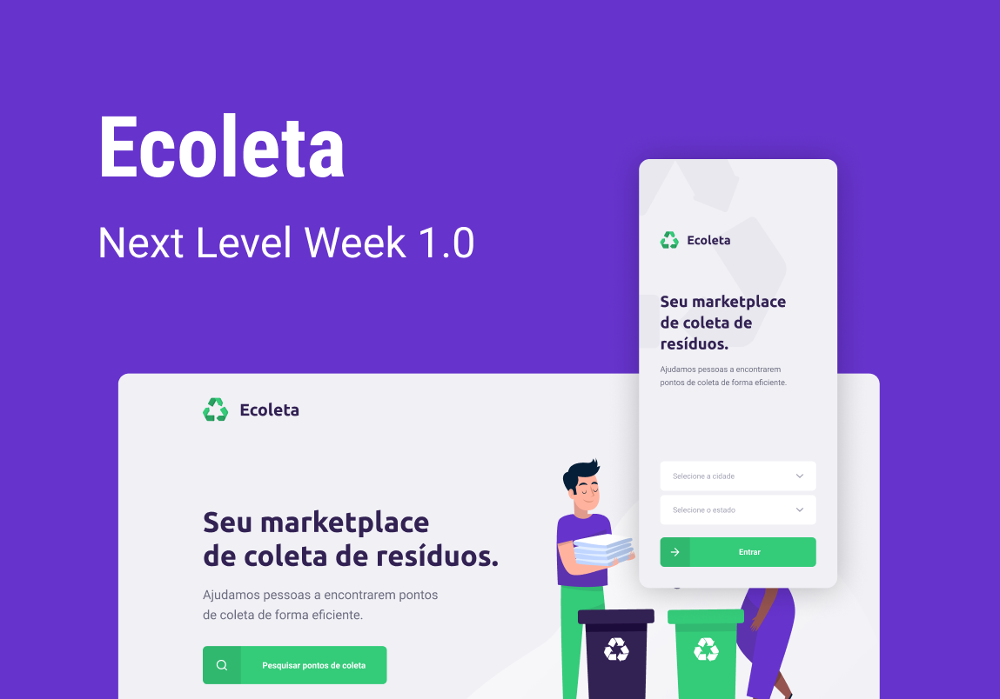
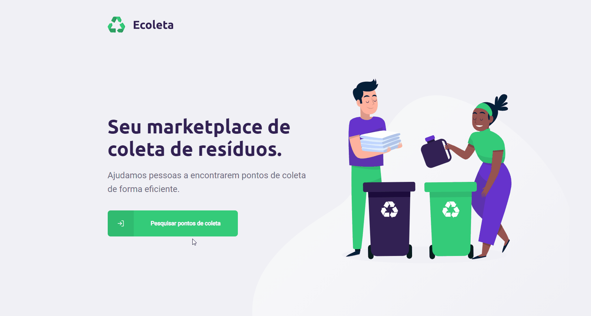

# 

Aplicação desenvolvida durante o evento **Next Level Week**

A aplicação é composta por:

- Back-end
- Front-end
- App Mobile

Na API estão disponíveis as rotas de listagem dos itens que podem ser coletados, criação de um ponto de coleta, procurar por um ponto de coleta específico e uma rota para filtrar pontos de coleta por cidade, estado e itens.

Na aplicação web, é possível cadastrar pontos de coleta com as principais informações de contato, localização, foto e itens que o estabelecimento faz coleta. Quando liberado o acesso a localização o mapa irá buscar pela localização atual para o carregamento inicial do mapa.

No aplicativo mobile, é onde encontramos os pontos de coletas, po rmeio de um filtro inicial por localização, e por itens. No carregamento do aplicativo o mapa abre com a localização atual, quando o usuário permite o acesso a localização do dispositivo.

## Back-end

Principais tecnologias utiizadas:

- node.js
- express
- TypeScript
- multer
- Knex
- SQLite

### Instruções para rodar a api

Código da api está na pasta server.

`yarn install && yarn dev:server`

## Front-end

Principais tecnologias utiizadas:

- React.js
- TypeScript

### Instruções para rodar aplicação web

Código do front-end está na pasta web.

`yarn install && yarn start`

## App Mobile

Principais tecnologias utiizadas:

- React Native
- TypeScript
- expo

### Instruções para rodar o aplicativo

Código do aplicativo está na pasta mobile.

`yarn install && expo start`
